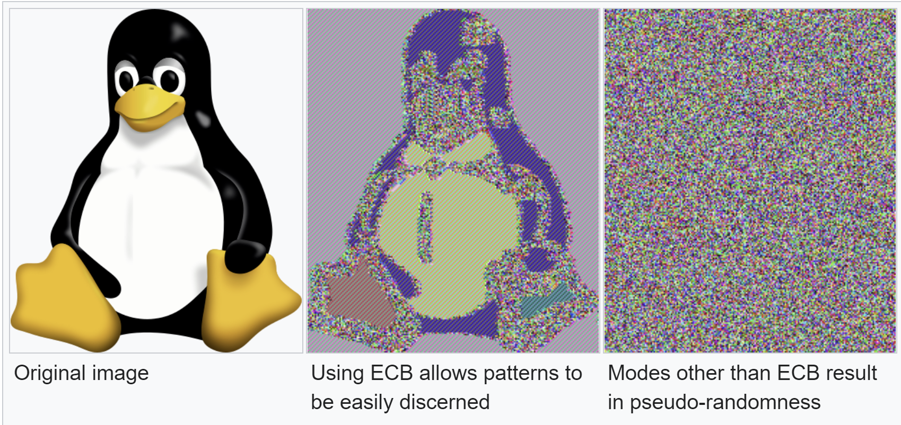
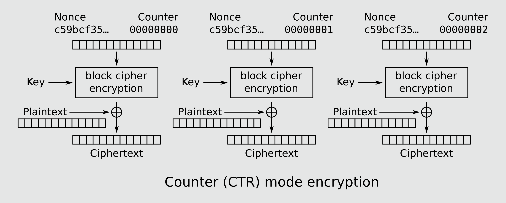

# Writeup

## tl;dr

Koden bruger AES-CTR mode, men som beskrivelsen hinter til, genbruges nonces fra nøglenissernes `CODEBOOK`, når de løber tør.
Få nonce + krypteret flag og send kontinuerligt en lang known plaintext, indtil nonce fra flag encryption gentages.
Herefter fås keystream ved XOR af known plaintext-ciphertext pair, og flaget fås så ved XOR af keystream og krypteret flag.

## Introduktion

Ved kørsel af scriptet mødes vi af følgende prompt:

```text
********************************
*  PostNordpolens Postcentral  *
*            Uge 47            *
********************************

1. Afhent breve til udlevering
2. Krypter og afsend besked
3. Afslut arbejdsdag
>
```

Vi kan altså tilsyneladende afhente en allerede krypteret besked til udlevering eller selv sende en besked og få den krypteret.

Her ses implementeringen af de to valg i kodens `main()` funktion (reduceret):

```py
enc_flag = encrypt(FLAG, KEY)

while True:
    choice = input("> ")

    if choice == "1":
        print(f"Du har 1 brev klar til udlevering: {enc_flag.hex()}")

    elif choice == "2":
        msg = input("Besked: ")
        addr = input("Adresse: ")
        ct = encrypt(msg.encode(), KEY)
        print(f"\nAfsendt til {addr}: {ct.hex()}")
```

Når scriptet køres, krypteres flaget altså som det første med en hardcoded nøgle, og samme krypterede flag udleveres, hver gang man vælger `1`.

Vælges i stedet `2` krypteres en selvvalgt besked på samme måde med samme key.
Men hvordan fungerer selve krypteringen?

```py
from Crypto.Cipher import AES
from secret import CODEBOOK

def encrypt(pt, key):
    nonce = CODEBOOK.next()
    cipher = AES.new(key, mode=AES.MODE_CTR, nonce=nonce)
    return nonce + cipher.encrypt(pt)
```

Krypteringen bruger AES (Advanced Encryption Standard), en af de mest anvendte symmetriske krypteringsmetoder, og benytter CTR mode.

## AES

AES er et block cipher, der krypterer en block af gangen på 16 bytes.

Som standard krypteres hver block separat, men det betyder, at samme 16-byte block krypteres til samme ciphertext, hvilket kan lede til statistiske angreb. Dette illustreres godt med et billede, hvor strukturer stadig ses tydeligt:



Man bruger derfor typisk en række forskellige "[modes](https://en.wikipedia.org/wiki/Block_cipher_mode_of_operation)", der på forskellig vis kommer dette problem til livs uden at ændre den underliggende krypteringsalgoritme. Separat kryptering af hver block kaldes "ECB (Electronic CodeBook) mode".

## CTR Mode

I funktionen `encrypt()` ovenfor ses, at der her bruges `MODE_CTR`, altså Counter mode, der kan visualiseres således:



Her vælges en "nonce" (number used once), og til denne appendes en counter, der tæller op for hver block.
I stedet for at kryptere plaintexten direkte med AES, så krypteres denne nonce + counter værdi, hvilket giver en "keystream", der kan XORes på plaintext for at kryptere denne.

Dvs. selv hvis samme plaintext block krypteres flere gange under samme key, vil ciphertext blive helt forskellige, da keystreamen vil være forskellig for hver block. Det smarte ved CTR mode er, at hele keystreamen kan genereres på forhånd både hos afsender og modtager, så kryptering og dekryptering er ekstremt effektiv, kan paralleliseres, og man kan kryptere/dekryptere en specifik block uafhængig af de resterende.

Det vigtige i CTR mode er, at noncen *aldrig* må genbruges til en ny kryptering under samme key, for så ender man med samme keystream til to forskellige krypteringer. Dvs. så har man følgende, hvor `ks` er keystream:

```text
ct1 = pt1 ^ ks
ct2 = pt2 ^ ks
```

Hvis en attacker tager XOR af disse to ciphertexts, forsvinder keystreamen (og dermed effekten af krypteringen) helt:

```text
ct1 ^ ct2 = pt1 ^ ks ^ pt2 ^ ks = pt1 ^ pt2
```

Pludselig står en attacker tilbage med XOR-værdien af de oprindelige plaintexts.
Hvis man derfor kan gætte eller selv styre den ene plaintext, kan man altså bare tage XOR af ovenstående med denne for at leake den anden.

## Enumeration

Det er præcis tilfældet i opgaven her, vi kan få krypteringen af flaget og af en besked, vi selv styrer - men dette er kun sårbart, hvis nonces genbruges.
I beskrivelsen hintes dog til dette: *"PostNordpolen udleverer vel omtrent 30 breve om dagen normalt - mon nøglenisserne har koder nok til en pludselig stigning?"* - potentielt har nøglenisserne altså kun koder nok i deres faste kodebog til denne mængde. De får en ny kodebog hver mandag, så den har altså potentielt kun nok til ca. 2-300 breve, hvorefter de vil være nødt til at starte forfra.

Scriptet importerer en hemmelig `CODEBOOK` og kalder ved hver encryption `CODEBOOK.next()` for at få en nonce.
Vi kan teste vores hypotese ved at lave et script, der bliver ved med at generere nye encryptions på serveren, indtil en nonce evt. genbruges:

```py
# Krypter tom streng for at få noncen direkte som output
nonce = get_encrypted(b"")
print(nonce.hex())

# Check for genbrug af nonce
for i in range(500):
    new_nonce = get_encrypted(b"")
    if new_nonce == nonce:
        print(f"Nonce reused after {i + 1} encryptions")
        break
```

Scriptet krypterer samme besked, indtil første nonce ses igen. Køres dette ses, at nonces genbruges efter 250 krypteringer!
Ved at kryptere en tom besked ses herudover, at noncen er 12 bytes. Nonce + counter skal være 16 bytes, så der er altså sat fire bytes af til en counter.

## Exploit

Angrebet herfra er simpelt: Få kryptering af flag og tilhørende nonce og krypter så 249 ligegyldige beskeder.
Herefter vil samme nonce fra krypteringen af flaget genbruges, så vi kan nu fx kryptere en lang streng af A'er og få et kendt plaintext-ciphertext par.

Dette par kan vi bruge til at leake keystream ved at XOR den kendte ciphertext med den kendte plaintext:

```text
known_ct = known_pt ^ ks  <=>  ks = known_pt ^ known_ct
```

Da samme nonce er brugt til kryptering af flaget, er keystreamen også ens, og flaget kan dekrypteres:

```text
flag = flag_ct ^ ks
```

Se fuldt solve script [her](../solution/solve.py).

Flag: `NC3{P0stN0rdp0l3n_3r_5t0r3_f0r74l3r3_f0r_g3nbrug}`
