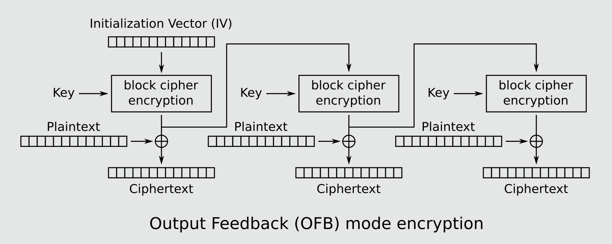
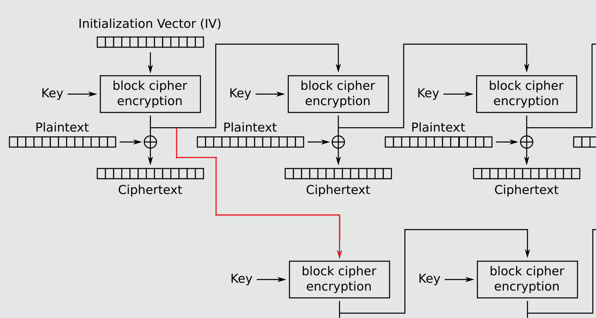
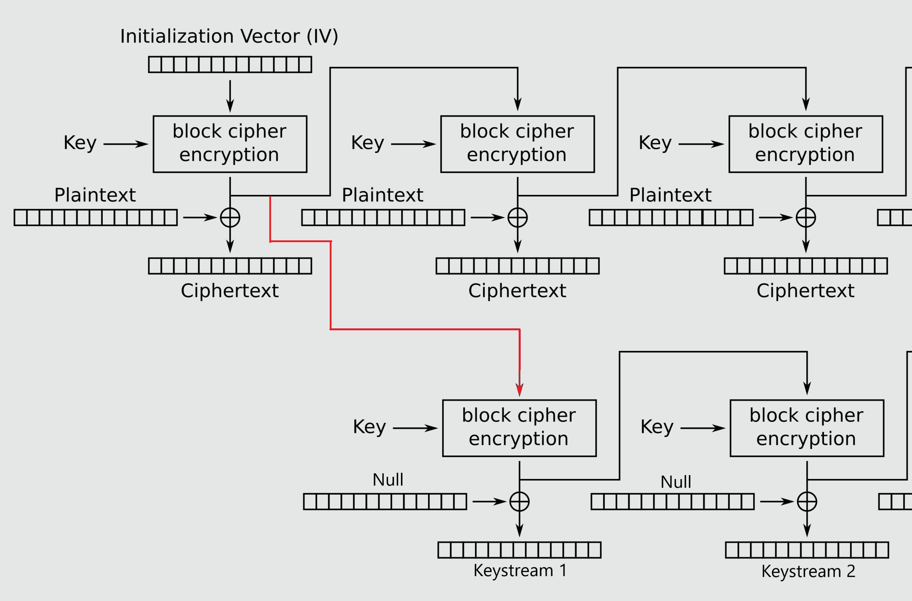

# Writeup

## tl;dr

Koden bruger AES-OFB mode, der genererer en keystream til kryptering af plaintext med simpel XOR.
Første block krypterer en IV, og herefter krypteres altid keystream fra foregående block.

OFB-mode kan brydes, hvis du kan styre IV og kender/gætter plaintext på første block (og dermed første block keystream).
Da kan keystream blocken inputtes som IV og leaker dermed den resterende keystream.

I opgaven prependes hver kryptering med `[BREV n] `, hvor `n` er et løbenummer.
Dvs. flagbesked starter med `[BREV n] NC3{`, og hvis `n` overstiger 1000, kender man derved en fuld block plaintext.
Med denne kan keystreamen leakes som beskrevet, og hele ciphertext dekrypteres.

## Introduktion

Ved kørsel af scriptet mødes vi af følgende prompt:

```text
********************************
*  PostNordpolens Postcentral  *
*            Uge 48            *
********************************

1. Afhent breve til udlevering
2. Krypter og afsend besked
3. Afslut arbejdsdag
>
```

Vi kan altså tilsyneladende afhente en allerede krypteret besked til udlevering eller selv sende en besked og få den krypteret.

Her ses implementeringen af de to valg i kodens `main()` funktion (reduceret):

```py
n = 1

while True:
    choice = input("> ")

    if choice == "1":
        iv = gen_secret()
        ct = encrypt(f"[BREV {n}]: {FLAG}".encode(), KEY, iv)
        print(f"Du har 1 brev klar til udlevering: {ct.hex()}")

    elif choice == "2":
        msg = input("Besked: ")
        addr = input("Adresse: ")
        iv = input_hex("IV: ")
        ct = encrypt(msg.encode(), KEY, iv)
        print(f"\nBREV {n} afsendt til {addr}: {ct.hex()}")

    n += 1
```

Hver besked sendt fra PostNordpolen prependes nu med `[BREV n] ` før kryptering, hvor `n` er et løbenummer.
Ved kryptering af flaget genereres en IV tilfældigt med nøglenissernes hemmelige fælles algoritme, men ved kryptering af egen besked styrer man selv IV.

Krypteringen bruger AES med OFB-mode:

```py
from Crypto.Cipher import AES

def encrypt(pt, key, iv=None):
    cipher = AES.new(key, mode=AES.MODE_OFB, iv=iv)
    return cipher.encrypt(pt)
```

## AES-OFB Mode

For generel info om AES og block cipher modes, se writeup til [PostNordpolen I](../../postnordpolen-1-ctr/writeup/).

Output Feedback (OFB) mode fungerer ligesom CTR mode ved at bruge selve krypteringsalgoritmen til at generere en lang keystream, der herefter blot XORes på plaintext for at kryptere denne. Ligesom CTR mode simulerer den derved et stream cipher:



I OFB mode bruges dog ikke en fortløbende counter værdi. I stedet krypteres først en Initialization Vector (IV) for at lave første keystream, og herefter fås næste blocks keystream ved at kryptere den foregående. Ligesom CTR mode kan hele streamen derfor pre-computes hos afsender og modtager, og selve krypteringen er enormt effektiv.

Det er vigtigt, at IV ikke genbruges under samme key, for så genskabes samme keystream.
Det samme gælder for enhver genereret keystream block - genbruges en block som input under samme key, vil resten af samme keystream genereres igen.

En attacker, der kender ét plaintext-ciphertext par fra en kryptering, vil kunne XOR disse for at få den tilsvarende keystream block.
Hvis attackeren samtidig selv kan styre IV, kan de benytte denne keystream block som IV og dermed generere resten af den oprindelige keystream:



# Exploit

Det er netop tilfældet her: Vi kan selv styre IV. Men vi kender jo ikke en plaintext block?
Ikke helt i hvert fald, men når vi som det første krypterer flaget, er plaintext fx `[BREV 1] NC3{` - 13 bytes.
Og hvad nu, hvis vi krypterer ni mere? Så er plaintext `[BREV 10] NC3{`, og vi har vundet en byte mere.
Krypterer vi flaget 1000 gange, får vi plaintext `[BREV 1000] NC3{` - en fuld 16-byte block!

Dvs. hvis vi tager nr. 1000 kryptering af flaget og XOR første ciphertext block med `[BREV 1000] NC3{`, så får vi første keystream block:

```py
# Forøg letter ID med 999, så flagkryptering har ID 1000
for i in trange(999):
    ct = encrypt_msg(b"", b"\x00" * 16)
flag_ct = encrypt_flag()

# Leak første keystream block fra kendt plaintext-ciphertext par
keystream = xor(b"[BREV 1000] NC3{", flag_ct[:16])
log.info(f"Keystream #1: {keystream.hex()}")
```

Vi kan nu leake *hele* keystreamen ved at inputte første keystream block som vores IV og bruge et kendt plaintext.
Det nemmeste er bare at kryptere en besked, der udelukkende består af null bytes, så får vi keystreamen ud direkte som ciphertext:



I hvert fald næsten, for null-beskeden vil automatisk få `[BREV 1001] ` prepended, det skal lige XORes ud:

```py
# Krypter null byte besked med første keystream block som IV
ct = encrypt_msg(b"\x00" * len(flag_ct), keystream)

# Husk at XOR brev ID ud med første del af ciphertext
keystream += xor(ct[:12], b"[BREV 1001] ") + ct[12:]
log.info(f"Keystream: {keystream.hex()}")
```

Nu har vi hele keystream og kan trivielt dekryptere hele flaget:

```py
flag = xor(flag_ct, ks)[:len(flag_ct)]
log.success(flag.decode())
```

Se fuldt solve script [her](../solution/solve.py).

Flag: `NC3{hv3m_h4r_brug_f0r_3n_k3y_n4r_m4n_k4n_g3n5k4b3_k3y5tr34m}`
