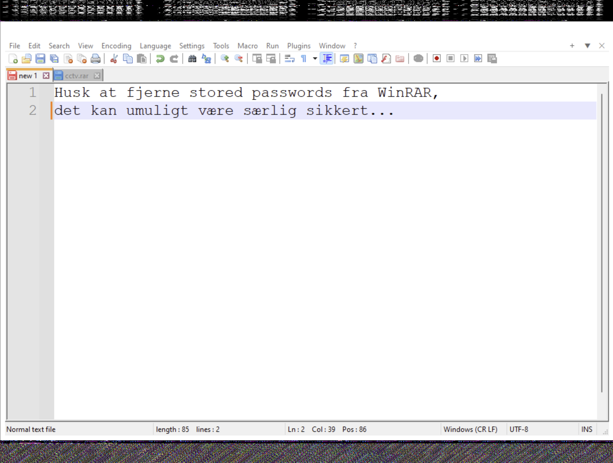
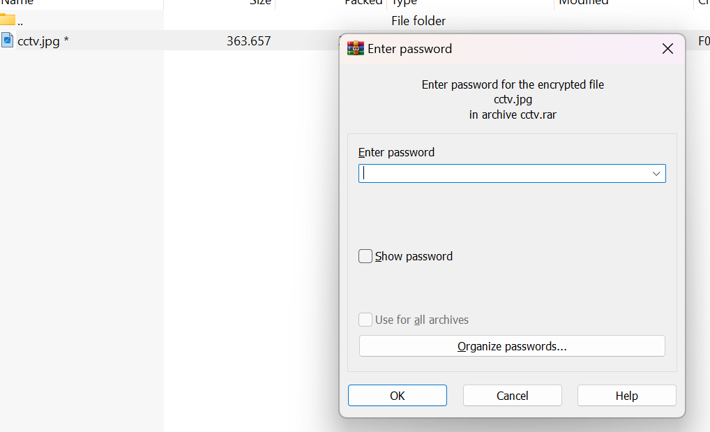
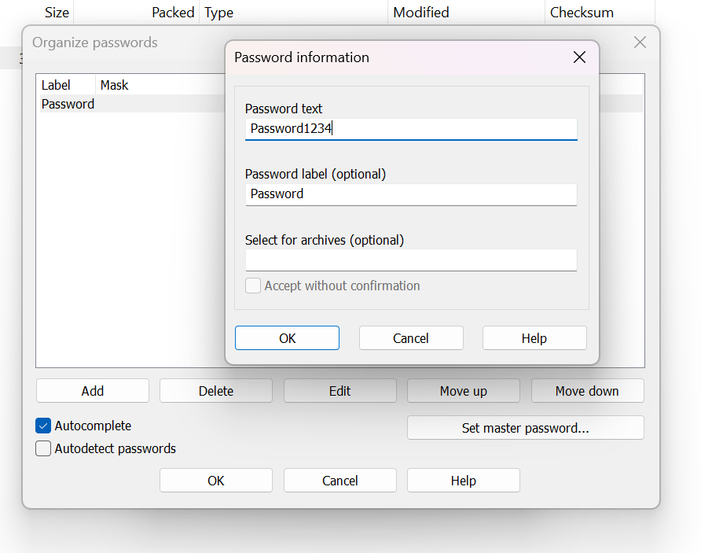
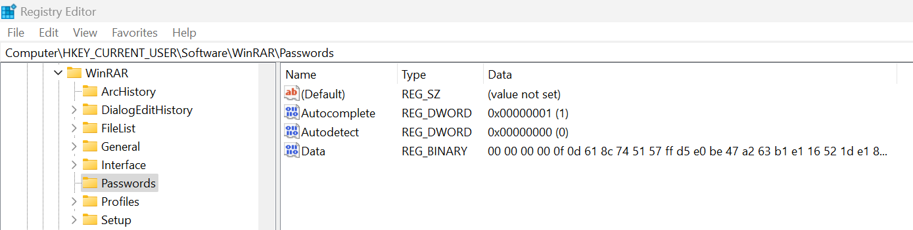
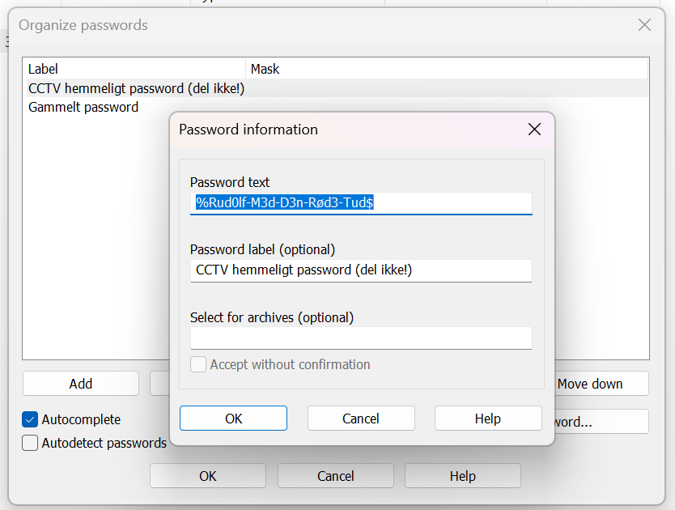
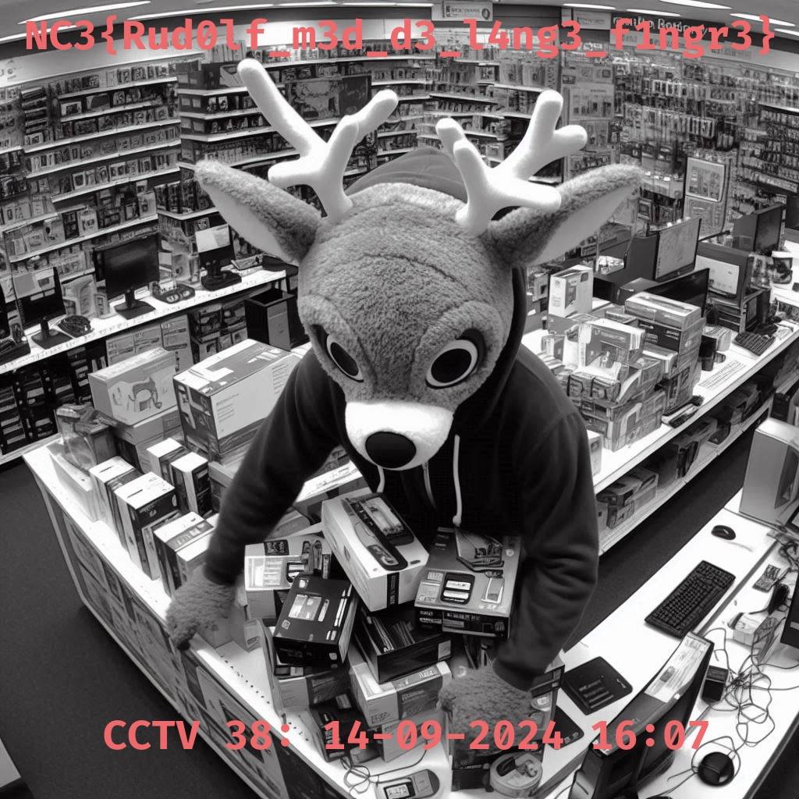

# Writeup

## tl;dr

Volatility viser WinRAR og Notepad++ i processlisten, og filen `\Users\Nis. E. Juul\Pictures\cctv.rar` extractes - den er passwordbeskyttet.
Fra Notepad++ extractes teksten "Husk at fjerne stored passwords fra WinRAR, det kan umuligt være særlig sikkert...".

Ved en lokal installation og test af WinRAR med stored passwords samt en Google søgning findes, at WinRAR gemmer stored passwords krypteret som binær data under `Data` i `HKEY_CURRENT_USER\Software\WinRAR\Passwords`.
Denne værdi kan extractes fra memory dumpet med Volatility.

Den nemmeste måde at dekryptere passwords er at indsætte værdien i egen registreringsdatabase med en lokal installation,
hvorefter WinRAR kan åbnes lokalt og passwordet `%Rud0lf-M3d-D3n-Rød3-Tud$` læses eller benyttes direkte på `cctv.rar`.

## Overblik

Den udleverede fil er et memory dump fra en Windows 11 maskine. Her virker Volatility 2 ikke, og `imageinfo` vil bare vise "No suggestion".
Volatility 3 virker dog upåklageligt, og det er typisk fornuftigt at starte med at se efter interessante processer og evt. brug af cmd line.

Vi kan få processer ud i et fint hierarkisk view med `windows.pstree`:

```cmd
$ vol3 -f nissetronix.mem windows.pstree > evidence/pstree.txt
```

Det, der stikker mest ud ligger umiddelbart under en explorer process her (output reduceret betydeligt):

```
* 4200  908     userinit.exe
** 4236 4200    explorer.exe
*** 3360        4236    notepad++.exe
*** 3364        4236    FTK Imager.exe
*** 8684        4236    WinRAR.exe
```

Her ser vi `FTK Imager`, der nok har været brugt til at dumpe, men også `notepad++` og `WinRAR`, begge interessante!

Brug af command line ses med `windows.cmdline`:

```cmd
$ vol3 -f nissetronix.mem windows.cmdline > evidence/cmdline.txt
```

Mest relevant er igen de samme to processer:

```
8684    WinRAR.exe      "C:\Program Files\WinRAR\WinRAR.exe" "C:\Users\Nis. E. Juul\Pictures\cctv.rar"
3360    notepad++.exe   "C:\Program Files\Notepad++\notepad++.exe"
```

Her ses, at WinRAR har været benyttet på filen `cctv.rar` under brugerens billedemappe.

## RAR-fil

Filen `cctv.rar` virker relevant og skal extractes. Derfor benyttes først `windows.filescan` for at få en liste over filer med tilhørende virtuel adresse:

```cmd
$ vol3 -f nissetronix.mem windows.filescan > evidence/filescan.txt
```

Vi kan i outputte greppe efter `cctv.rar` og finder to referencer:

```cmd
$ grep -i cctv evidence/filescan.txt
0xe60de03914d0  \Users\Nis. E. Juul\Pictures\cctv.rar
0xe60de0551dd0  \Users\Nis. E. Juul\Pictures\cctv.rar
```

Den første kan extractes med `windows.dumpfiles` og dens virtuelle adresse:

```cmd
$ vol3 -f nissetronix.mem windows.dumpfiles --virtaddr 0xe60de03914d0
```

Dette trækker en `.dat` og `.vacb` fil ud. Præcis samme filer kan extractes fra den anden adresse (`0xe60de0551dd0`).
Vi omdøber datafilen til `cctv.rar` og verificerer, det ser korrekt ud med `file`:

```cmd
$ file cctv.rar
cctv.rar: RAR archive data, v5
```

Den RAR fil må kunne extractes!

```cmd
$ unrar x cctv.rar
Extracting from cctv.rar
Enter password (will not be echoed) for cctv.jpg:
```

Hmm, der er brug for et password. Her kan man prøve at cracke, men der kommer man ingen vegne.

## Notepad++

Notepad++ processen stikker også ud og kunne være interessant at undersøge!
Vi starter med at trække processens hukommelse ud med `windows.memmap`:

```cmd
$ mkdir dump
$ vol3 -f nissetronix.mem -o dump windows.memmap --pid 3360 --dump
```

Her kan man med fordel trykke `Ctrl+C` ret hurtigt efter kørsel for at stoppe processen.
Volatility trækker typisk alt for meget ud, langt mere end selve processens hukommelse, og det relevante er typisk i de første få MB.

Vi kan køre `strings` på outputtet og søge efter fx "password":

```cmd
$ strings pid.3360.dmp | grep -i password
```

Det finder flere resultater, der starter med "Husk at fjerne stored passwords fra WinRAR,".
Hvis vi vil have mere info kan man bruge `-C 5` for at få fem linjers kontekst fra hvert resultat. Så ser vi

```
Husk at fjerne stored passwords fra WinRAR,
det kan umuligt v
re s
rlig sikkert...
```

Da `strings` kun forstår ASCII chars, står der nok "det kan umuligt være særlig sikkert..."
Det virker altså til, at der har været benyttet stored passwords i WinRAR her.

I dette tilfælde kunne teksten findes ved et gæt på "password" som string, men det er ikke en særlig pålidelig metode.
En sjovere og mere generel metode er at visualisere processens hukommelse, da selve GUI vinudet gemmes her som rå image data.
Der er et fint blog post om, hvordan man kan gøre det [her](https://beguier.eu/nicolas/articles/security-tips-2-volatility-gimp.html).

Jeg har også selv skrevet et tool til formålet, der visualiserer data som rå image data: [https://github.com/Nissen96/Raw-Image-Extractor](https://github.com/Nissen96/Raw-Image-Extractor).
Det visualiserer ud fra en række standard screen widths og image modes (fx RGB, RGBA, BGRx), så man hurtigt kan skimme henover og finde visuel data, fx skærmvinduer.

Man kan sætte en fornuftig image height, der gør det nemt at skimme over, fx 8000:

```cmd
$ python3 extract-images.py --height 8000 pid.3360.dmp
```

Herudover er data på Windows gemt i et BMP format, altså i BGRx mode, hvilket kan sættes med `--mode BGRx`.
Sætter man ingen mode, vil den extracte forskellige muligheder, også BGRx.

Scroller man igennem resultaterne, findes en perfekt visualisering af Notepad++ vinduet med i BGRx mode med width 1024:



Denne metode er enormt generel og vil virke med rigtig mange applikationer (også WinRAR hukommelsen), eller endda give et screenshot af hele skærmen.

Som før ser vi, at der står "Husk at fjerne stored passwords fra WinRAR, det kan umuligt være særlig sikkert...",
så vi er igen interesserede i gemte passwords i WinRAR.

## WinRAR: Stored Passwords

Den nemmeste måde at undersøge, hvordan stored passwords virker i WinRAR, er at downloade WinRAR og prøve det af selv.

Hvis vi prøver at åbne `cctv.rar` med WinRAR og extracte `cctv.jpg`, spørger den om password:



Der er en tom dropdown liste og en "Organize passwords..." knap.
Her kan man tilføje et password, vi prøver tilfældigt "Password1234":



Hvis vi lukker og åbner WinRAR kan vi se, det er gemt. Men hvor gemmes det?

En Google søgning leder til et par links:

[https://documentation.help/WinRAR/HELPOrgPasswords.htm](https://documentation.help/WinRAR/HELPOrgPasswords.htm)

"Please be aware that saved passwords are stored in Registry in insecure format. So anybody having access to your computer may be able to retrieve them."

Så passwords ligger umiddelbart gemt i registry! Men hvor? Det mest naturlige sted at lede efter indstillinger for installerede applikationer under "Software",
enten i `HKEY_LOCAL_MACHINE` eller `HKEY_CURRENT_USER` - den første til systemwide indstillinger, den anden til brugerens egne. Passwords er nok brugerspecifikke, så et godt bud er `HKEY_CURRENT_USER`.
Det kan hurtigt verificeres manuelt, men en Google søgning på "WinRAR passwords registry" giver også mindst to gode resultater:

[https://documentation.help/WinRAR/HELPRegVar.htm](https://documentation.help/WinRAR/HELPRegVar.htm)

[https://superuser.com/questions/1686094/how-to-export-winrar-profiles-to-another-computer](https://superuser.com/questions/1686094/how-to-export-winrar-profiles-to-another-computer)

Den første er ikke specifik for passwords, men nævner `HKEY_LOCAL_MACHINE\Software\WinRAR\Policy` og `HKEY_CURRENT_USER\Software\WinRAR\Policy`, så nøglen `WinRAR` på denne placering er i hvert fald relevant.
Den anden er mere konkret og et svar her viser, at passwords nok ligger i `HKEY_CURRENT_USER\Software\WinRAR\Passwords`.

Med en lokal installation og et test password opsat, kan vi åbne `regedit` og tjekke denne key.
Vi ser den har key-value nodes for "Autocomplete", "Autodetect" og "Data", der indeholder binær data:



Den ser interessant ud og kunne være vores passwords i et krypteret eller encoded format.

Hypotesen bekræftes ved at tilføje et stored password mere, refreshe `Data` key og se, værdien forøges. Modsat, fjernes de helt, formindskes `Data` værdien.

Den værdi virker relevant at udtrække fra vores memory image.

## Volatility: Registry

Vi finder alle registry hives med Volatility med plugin `windows.registry.hivelist`:

```cmd
$ vol3 -f nissetronix.mem windows.registry.hivelist > evidence/hivelist.txt
```

Hivet `HKEY_CURRENT_USER` for en given bruger ligger altid som fil under brugerens hovedmappe, navngivet `NTUSER.DAT`.
Vi finder den for `Nis. E. Juul` med `grep`:

```
$ grep -i NTUSER.DAT evidence/hivelist.txt
0x9f8e71b3b000  \??\C:\Windows\ServiceProfiles\NetworkService\NTUSER.DAT        Disabled
0x9f8e72418000  \??\C:\Windows\ServiceProfiles\LocalService\NTUSER.DAT  Disabled
0x9f8e72eaf000  \??\C:\Users\Nis. E. Juul\ntuser.dat    Disabled
```

Den nederste er den relevante, så vi noterer `0x9f8e72eaf000` og kan nu kigge specifikt i det hive og benytte `windows.registry.printkey` til at få værdierne fra den relevante sti:

```cmd
$ vol3 -f nissetronix.mem windows.registry.printkey --offset 0x9f8e72eaf000 --key "Software\WinRAR\Passwords"
```

Det giver følgende tre key-value nodes, hvor især `Data` er interessant:

```
Last Write Time Hive Offset     Type    Key     Name    Data    Volatile

2024-09-15 12:09:25.000000 UTC  0x9f8e72eaf000  REG_BINARY      \??\C:\Users\Nis. E. Juul\ntuser.dat\Software\WinRAR\Passwords  Data    "
00 00 00 00 0f f4 20 fe 0e dc 12 c0 10 a2 8e 6c ...... ........l
cb fe b2 d5 7a c8 a6 c7 bf d4 13 34 2b 31 65 04 ....z......4+1e.
d7 70 2e 43 59 f0 8f 0b 9b d0 29 1d c9 e0 60 27 .p.CY.....)...`'
09 b5 55 e9 42 55 b0 36 a6 87 35 fb d2 f8 4c 15 ..U.BU.6..5...L.
f6 a3 69 c3 05 02 5d a4 cb 87 5c 2a d8 ac 88 8d ..i...]...\*....
b9 54 bb ee 70 b4 f6 d2 fd 1d 0c b6 0b aa 50 51 .T..p.........PQ
f7 99 27 16 63 cc 3d f5 d5 82 87 9e d0 f4 11 7f ..'.c.=.........
24 db 3f 97 e1 af 40 b4 03 56 a7 0d 0d 8f 16 af $.?...@..V......
02 c8 87 58 ce 97 9a 88 06 c7 d1 da 7d 08 bb c7 ...X........}...
07 b4 3f 6c 06 bf 4b 0d 6a 4e 01 ad 9d 15 b2 6e ..?l..K.jN.....n
5c 15 49 98 7b 62 40 85 31 a3 bd 6d e6 1d 9c b5 \.I.{b@.1..m....
43 bf f2 cf 49 4a 4c 11 d9 0b 92 8d 5f c0 59 5b C...IJL....._.Y[
48 04 12 79 38 78 36 fc 4c 34 43 22 c3 61 43 5f H..y8x6.L4C".aC_
a0 9b c3 37 92 fd 9d d5 bc a7 9a 9f 23 1e 3c 0b ...7........#.<.
9c 37 29 71 0f 0c 1a 21 9c c1 e8 6d 02 88 76 8d .7)q...!...m..v.
c7 a2 ed 71 a2 ed 4e 95 4d a5 1a 43 be          ...q..N.M..C."  False
2024-09-15 12:09:25.000000 UTC  0x9f8e72eaf000  REG_DWORD       \??\C:\Users\Nis. E. Juul\ntuser.dat\Software\WinRAR\Passwords  Autocomplete    1   False
2024-09-15 12:09:25.000000 UTC  0x9f8e72eaf000  REG_DWORD       \??\C:\Users\Nis. E. Juul\ntuser.dat\Software\WinRAR\Passwords  Autodetect      0   False
```

Det viser som forventet, at der ligger et (eller flere) encrypted password for brugeren. Vi extracter selve hex værdierne:

```
00 00 00 00 0f f4 20 fe 0e dc 12 c0 10 a2 8e 6c
cb fe b2 d5 7a c8 a6 c7 bf d4 13 34 2b 31 65 04
d7 70 2e 43 59 f0 8f 0b 9b d0 29 1d c9 e0 60 27
09 b5 55 e9 42 55 b0 36 a6 87 35 fb d2 f8 4c 15
f6 a3 69 c3 05 02 5d a4 cb 87 5c 2a d8 ac 88 8d
b9 54 bb ee 70 b4 f6 d2 fd 1d 0c b6 0b aa 50 51
f7 99 27 16 63 cc 3d f5 d5 82 87 9e d0 f4 11 7f
24 db 3f 97 e1 af 40 b4 03 56 a7 0d 0d 8f 16 af
02 c8 87 58 ce 97 9a 88 06 c7 d1 da 7d 08 bb c7
07 b4 3f 6c 06 bf 4b 0d 6a 4e 01 ad 9d 15 b2 6e
5c 15 49 98 7b 62 40 85 31 a3 bd 6d e6 1d 9c b5
43 bf f2 cf 49 4a 4c 11 d9 0b 92 8d 5f c0 59 5b
48 04 12 79 38 78 36 fc 4c 34 43 22 c3 61 43 5f
a0 9b c3 37 92 fd 9d d5 bc a7 9a 9f 23 1e 3c 0b
9c 37 29 71 0f 0c 1a 21 9c c1 e8 6d 02 88 76 8d
c7 a2 ed 71 a2 ed 4e 95 4d a5 1a 43 be
```

## Dekryptering

Stored passwords er krypterede, og en evt. reversing af WinRAR viser, at det er noget AES, hvor både key, IV og ciphertext ligger i dataen.
Det er dog på *ingen* måde en triviel process at reverse sig frem til, og der er en langt simplere metode: Smid `Data` værdien i din egen lokale registry og åbn stored passwords i WinRAR, så klarer den dekrypteringen automatisk.

Dataen kan lægges i registry som et byte array med `Set-ItemProperty` i PowerShell:

```ps1
Set-ItemProperty -Path 'HKCU:\Software\WinRAR\Passwords' -Name Data -Value ([byte[]](0x00,0x00,0x00,0x00,0x0f,0xf4,0x20,0xfe,0x0e,0xdc,0x12,0xc0,0x10,0xa2,0x8e,0x6c,0xcb,0xfe,0xb2,0xd5,0x7a,0xc8,0xa6,0xc7,0xbf,0xd4,0x13,0x34,0x2b,0x31,0x65,0x04,0xd7,0x70,0x2e,0x43,0x59,0xf0,0x8f,0x0b,0x9b,0xd0,0x29,0x1d,0xc9,0xe0,0x60,0x27,0x09,0xb5,0x55,0xe9,0x42,0x55,0xb0,0x36,0xa6,0x87,0x35,0xfb,0xd2,0xf8,0x4c,0x15,0xf6,0xa3,0x69,0xc3,0x05,0x02,0x5d,0xa4,0xcb,0x87,0x5c,0x2a,0xd8,0xac,0x88,0x8d,0xb9,0x54,0xbb,0xee,0x70,0xb4,0xf6,0xd2,0xfd,0x1d,0x0c,0xb6,0x0b,0xaa,0x50,0x51,0xf7,0x99,0x27,0x16,0x63,0xcc,0x3d,0xf5,0xd5,0x82,0x87,0x9e,0xd0,0xf4,0x11,0x7f,0x24,0xdb,0x3f,0x97,0xe1,0xaf,0x40,0xb4,0x03,0x56,0xa7,0x0d,0x0d,0x8f,0x16,0xaf,0x02,0xc8,0x87,0x58,0xce,0x97,0x9a,0x88,0x06,0xc7,0xd1,0xda,0x7d,0x08,0xbb,0xc7,0x07,0xb4,0x3f,0x6c,0x06,0xbf,0x4b,0x0d,0x6a,0x4e,0x01,0xad,0x9d,0x15,0xb2,0x6e,0x5c,0x15,0x49,0x98,0x7b,0x62,0x40,0x85,0x31,0xa3,0xbd,0x6d,0xe6,0x1d,0x9c,0xb5,0x43,0xbf,0xf2,0xcf,0x49,0x4a,0x4c,0x11,0xd9,0x0b,0x92,0x8d,0x5f,0xc0,0x59,0x5b,0x48,0x04,0x12,0x79,0x38,0x78,0x36,0xfc,0x4c,0x34,0x43,0x22,0xc3,0x61,0x43,0x5f,0xa0,0x9b,0xc3,0x37,0x92,0xfd,0x9d,0xd5,0xbc,0xa7,0x9a,0x9f,0x23,0x1e,0x3c,0x0b,0x9c,0x37,0x29,0x71,0x0f,0x0c,0x1a,0x21,0x9c,0xc1,0xe8,0x6d,0x02,0x88,0x76,0x8d,0xc7,0xa2,0xed,0x71,0xa2,0xed,0x4e,0x95,0x4d,0xa5,0x1a,0x43,0xbe))
```

Nu er vores `Data` sat lokalt til samme værdi, som `Nis. E. Juul` havde på sin maskine.
Åbnes WinRAR ses nu to nye passwords i "Organize passwords" menuen:



Det ene har label `Gammelt password` og passwordet er `Password1234!`. Det har dog ingen relevans.

Det andet har label `CCTV hemmeligt password (del ikke!)` og virker mere interessant.
Passwordet her er `%Rud0lf-M3d-D3n-Rød3-Tud$` og det kan bruges til at dekryptere RAR-filen!

Filen indeholder et CCTV-billede, der tydeligt viser, at det absolut ikke var et ægte rensdyr, der røvede Nissetronix, Rudolf er ren!



Flag: `NC3{Rud0lf_m3d_d3_l4ng3_f1ngr3}`
